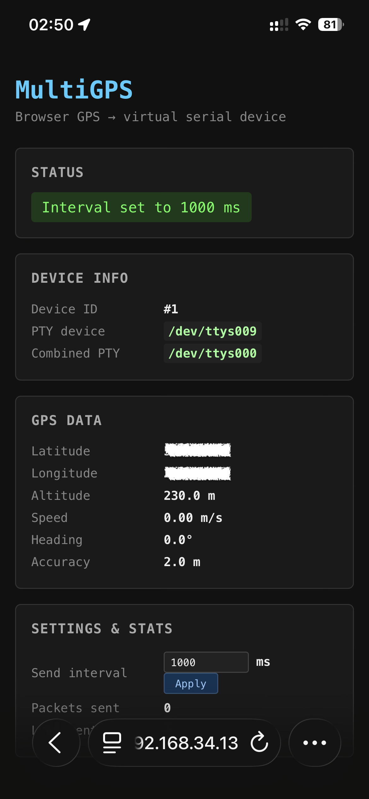
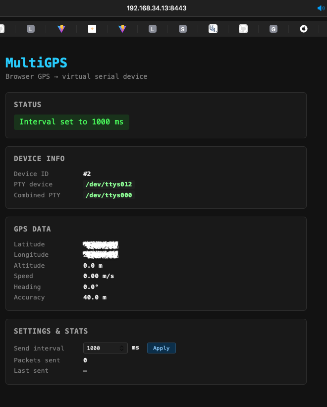
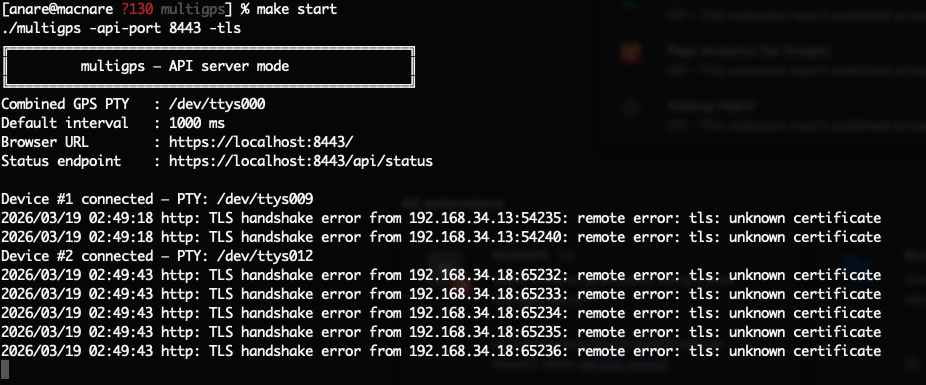
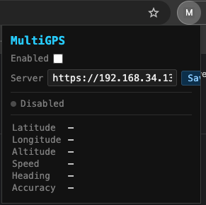
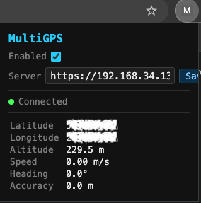

# [MultiGPS](https://github.com/anare/multigps.git)

A MultiGPS combined GPS receiver.
Through a Chrome extension and Web API, it can spoof the Geolocation API in the browser, while also providing a virtual GPS device on the system that any GPS-aware software can read from.
A fake USB GPS device written in **Go** (CLI + NMEA generation) and **C** (PTY virtual serial port).  
It creates a virtual serial port on your Mac (e.g. `/dev/ttys003`) that any GPS-aware software — `gpsd`, `screen`, `minicom`, etc. — can open as if it were a real USB GPS receiver.

## How to Run

1. **Clone the repository and enter the project directory**

   ```bash
   git clone https://github.com/anare/multigps.git
   cd multigps
   ```

2. **Build and start the server on your PC**

   ```bash
   make build
   make start
   ```

3. **Install and trust the local certificate, then load the browser extension on your PC**

   1. Open Chrome on your PC and go to:

      ```text
      chrome://certificate-manager/localcerts/usercerts
      ```

   2. Under **Trusted certificates**, click **Import**

   3. Select `server.crt` from the project directory

   4. Enable **Trust this certificate for identifying websites**

   5. Open **Extensions**

   6. Enable **Developer mode**

   7. Click **Load unpacked**

   8. Select the `extension` directory

4. **Connect your mobile devices to the server**

   1. Open on each mobile device:

      ```text
      https://<host-ip>:8443/
      ```

   2. Accept and trust the certificate

   3. Tap **Apply**

   4. Repeat for each device you want to connect

5. **Open Google Maps on your PC and choose your target location**

6. **Done — location updates from connected devices are now available**

## Screenshots










## Requirements

| Tool | Version |
|------|---------|
| Go   | ≥ 1.21  |
| Xcode Command Line Tools (`clang`) | any recent |

Install Xcode CLT if needed:
```sh
xcode-select --install
```

## Build

```sh
git clone https://github.com/anare/multigps.git
cd multigps
make build        # produces ./multigps
# or
make install      # installs to /usr/local/bin/multigps
```

## Usage

### Static mode (fixed position, runs until Ctrl-C)

```sh
./multigps -lat 37.7749 -lon -122.4194 -alt 10 -speed 0 -course 0
```

### Interactive mode (update position while running)

```sh
./multigps -lat 37.7749 -lon -122.4194 -interactive
```

Then type update commands on stdin:

```
lat=48.8566 lon=2.3522 alt=35 speed=5.5 course=90
```

Type `q` or `quit` to exit.

### All flags

| Flag             | Default        | Description                              |
|------------------|----------------|------------------------------------------|
| `-lat`           | `37.7749`      | Latitude in decimal degrees              |
| `-lon`           | `-122.4194`    | Longitude in decimal degrees             |
| `-alt`           | `10.0`         | Altitude in metres                       |
| `-speed`         | `0.0`          | Speed over ground in knots               |
| `-course`        | `0.0`          | Course over ground in degrees (0–360)    |
| `-interval`      | `1000`         | NMEA update interval in milliseconds     |
| `-interactive`   | `false`        | Enable interactive stdin updates         |
| `-status-port`   | `0`            | Expose GET /api/position for the Chrome extension |
| `-api-port`      | `0`            | Enable HTTP/HTTPS API server on port     |
| `-api-interval`  | `1000`         | Default GPS send interval for API clients |
| `-tls`           | `false`        | Enable HTTPS (required for Geolocation API on non-localhost) |
| `-tls-cert`      | `server.crt`   | TLS certificate file (auto-generated if missing) |
| `-tls-key`       | `server.key`   | TLS private key file (auto-generated if missing) |

### API server mode with HTTPS

Browsers block the Geolocation API on plain HTTP origins other than `localhost`.
Use `-tls` when accessing multigps from another device (phone, tablet, etc.) on
the same network.

```sh
# First run: generates server.crt + server.key automatically
./multigps -api-port 8443 -tls
```

Open the printed URL on your device (e.g. `https://192.168.1.10:8443/`).  
The browser will warn about the self-signed certificate — click **Advanced →
Proceed** (Chrome) or **Accept the Risk** (Firefox) to continue.

You can supply your own certificate instead:

```sh
./multigps -api-port 8443 -tls -tls-cert /etc/ssl/my.crt -tls-key /etc/ssl/my.key
```

## Connecting GPS software

After starting `multigps` the virtual device path is printed, e.g.:

```
Virtual GPS device : /dev/ttys003
```

Connect with `gpsd`:
```sh
gpsd -N -n /dev/ttys003
```

Monitor raw NMEA with `screen`:
```sh
screen /dev/ttys003 4800
```

Or pipe through `cat`:
```sh
cat /dev/ttys003
```

## NMEA sentences emitted

| Sentence | Description                        |
|----------|------------------------------------|
| `$GPGGA` | Fix data (lat, lon, alt, quality)  |
| `$GPRMC` | Minimum recommended GPS data       |

## Chrome extension — spoof browser geolocation

The `extension/` directory contains a Manifest V3 Chrome extension that reads
the current GPS position from a running multigps server and overrides
`navigator.geolocation` on every page so Chrome's Geolocation API returns the
faked coordinates instead of the device's real location.

### How it works

```
multigps server  ──GET /api/position──▶  background.js (service worker)
                                              │ chrome.storage.local
                                        content.js (isolated world)
                                              │ CustomEvent
                                        inject.js (MAIN world)
                                              │ override
                                        navigator.geolocation
```

### Setup

1. **Start the multigps server** with an HTTP status port:

   **PTY mode** (fixed / interactive position):
   ```sh
   ./multigps -lat 37.7749 -lon -122.4194 -status-port 8080
   # or with interactive updates:
   ./multigps -lat 37.7749 -lon -122.4194 -status-port 8080 -interactive
   ```

   **API server mode** (combined average of connected browser tabs):
   ```sh
   ./multigps -api-port 8080
   ```
   The `/api/position` endpoint is available on both modes.

2. **Load the extension in Chrome**:
   - Open `chrome://extensions`
   - Enable **Developer mode** (top-right toggle)
   - Click **Load unpacked** and select the `extension/` directory

3. **Configure the extension** (if the server is not on `http://localhost:8080`):
   - Click the MultiGPS icon in the Chrome toolbar
   - Update the **Server** URL and click **Save**

4. Visit any site that uses `navigator.geolocation` — it will receive the
   coordinates configured in multigps.

### Extension files

| File | Role |
|------|------|
| `manifest.json` | MV3 extension manifest |
| `background.js` | Service worker — polls `/api/position` every second, stores result in `chrome.storage.local` |
| `content.js`    | Content script (isolated world) — injects `inject.js`, relays storage changes to the page |
| `inject.js`     | Runs in the page's MAIN world — overrides `navigator.geolocation` |
| `popup.html/js` | Toolbar popup — configure server URL, toggle enable/disable, view live position |

## Architecture

```
┌─────────────────────────────┐
│  Go CLI  (main.go)          │  ← parses flags, runs event loop
│  NMEA generator (nmea.go)   │  ← builds $GPGGA / $GPRMC sentences
│  CGo bridge                 │  ← calls C via import "C"
└────────────┬────────────────┘
             │ CGo
┌────────────▼────────────────┐
│  C PTY layer (pty.c)        │  ← posix_openpt / ptsname / cfmakeraw
│  Virtual serial port        │  ← /dev/ttysNNN  (macOS)
└─────────────────────────────┘
             │ reads NMEA
┌────────────▼────────────────┐
│  GPS software (gpsd, etc.)  │
└─────────────────────────────┘
```

